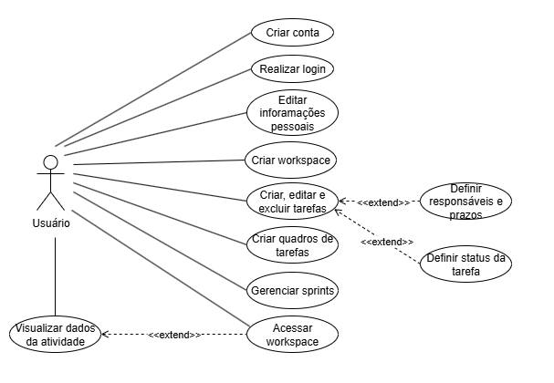

# Casos de Uso

## 🎭 Atores

1. **Usuário**: Ator principal, realiza todas as interações.

## ✅ Casos de Uso

### 1. Criar Conta
- **Ator**: Usuário
- **Descrição**: Cadastro com nome, e-mail e senha.

### 2. Realizar Login
- **Ator**: Usuário
- **Descrição**: Autenticação via e-mail e senha.

### 3. Editar Informações Pessoais
- **Ator**: Usuário
- **Descrição**: Atualização de nome, e-mail ou senha.

### 4. Criar, Editar e Excluir Tarefas
- **Ator**: Usuário
- **Descrição**: Gerenciar tarefas em workspaces.
- **Estende**: `Definir responsáveis e prazos`, `Definir status da tarefa`

### 5. Definir Responsáveis e Prazos
- **Ator**: Usuário
- **Descrição**: Definição de responsáveis e prazos ao criar/editar tarefas.

### 6. Definir Status da Tarefa
- **Ator**: Usuário
- **Descrição**: Permite atualizar status das tarefas.

### 7. Criar Quadros de Tarefas
- **Ator**: Usuário
- **Descrição**: Criação de quadros Kanban/Scrum.

### 8. Gerenciar Sprints
- **Ator**: Usuário
- **Descrição**: Criar e gerenciar sprints vinculados a quadros Scrum.

### 9. Acessar Workspace
- **Ator**: Usuário
- **Descrição**: Acessar workspaces em que participa.
- **Estende**: `Visualizar dados da atividade`

### 10. Visualizar Dados da Atividade
- **Ator**: Usuário
- **Descrição**: Visualização detalhada de tarefas.

### 11. Visualizar Dashboards
- **Ator**: Usuário
- **Descrição**: Acompanhar dashboards de progresso.

---

## 📈 Diagrama UML

